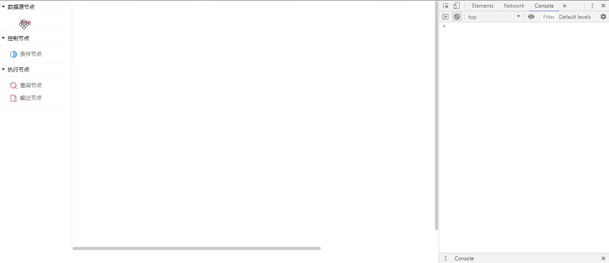

## flow-editor
- flow-editor本人基于processOn构建开发的流程图编辑器，拖拉拽的流程图编辑器，可以自定义分组，节点图像，样式，节点属性信息，箭头线条信息， 单击，双击，右键菜单，键盘热键均有封装，支持二次开发，提供一套更优的前端解决方案
- 支持拖拉拽控件，支持二次拖来拽
- 支持和vue或者react的主流js框架兼容和通讯
- 前后端分离，通过token进行数据交互，可独立部署
- 下载电脑本地，直接浏览器打开flow-editor\demo\html\index\flow\flow.html文件运行

